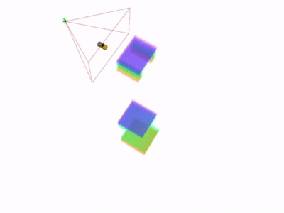
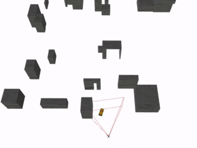
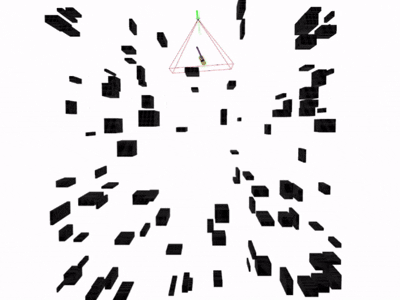
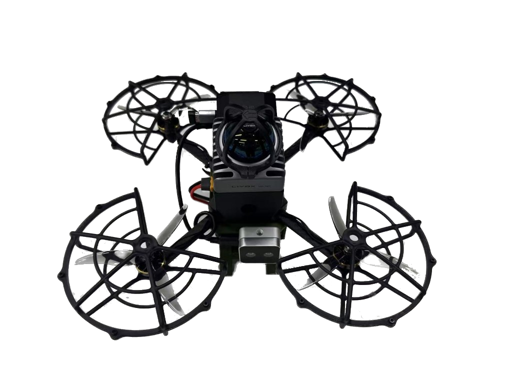

# Eva-Tracker

__Eva-Tracker__ is an ESDF-update-free, Visibility-Aware trajectory planning framework for aerial tracking, which employs a fast __candidate-correction__ approach to generate initial paths, and employs a novel __FoV-ESDF__ for visibility-aware trajectory optimization. For detailed technical information, please refer to our paper:

[__Eva-Tracker: ESDF-update-free, Visibility-aware Planning with Target Reacquisition for Robust Aerial Tracking__](https://arxiv.org/abs/2602.12549) __(ICRA 2026)__.

Authors: [Yue Lin](https://github.com/Yue-0), Yang Liu, Dong Wang, Huchuan Lu.

  

## Quick Start

In Ubuntu20.04 & ROS-noetic:

```shell
git clone https://github.com/Yue-0/Eva-Tracker.git && cd Eva-Tracker
```

### Run in simulation

If `quadrotor_msgs` is not available in your environment, please unzip the simple version:

```shell
unzip quadrotor_msgs.zip
```

Compile this project:

```shell
catkin_make
```

Start the simulation environment:

```shell
roslaunch simulator simulation.launch
```

Start the tracker in another terminal, and the tracker will track the target autonomously:

```shell
roslaunch tracker tracking.launch
```

You can use `2D Nav Goal` to control the target movement, or use `Publish Point` to start/stop random movement of the target.

### Run in real world

Our drone platform is shown in the figure, equipped with a Livox Mid-360 LiDAR and an Intel RealSense depth camera. The computing platform is Jetson Orin NX.



For the first run, make sure your device supports `TensorRT` and then export the object detection model, which would take a while:

```shell
python3 onnx2trt.py
```

Make sure your device supports CUDA, then compile the project.

```shell
catkin_make
```

Before launch the tracker, please enable [PX4](https://github.com/mavlink/mavros) and [FasterLIO](https://github.com/gaoxiang12/faster-lio):

```shell
sudo -S chmod 777 /dev/tty*
roslaunch mavros px4.launch
rosrun mavros mavcmd long 511 105 5000 0 0 0 0 0
rosrun mavros mavcmd long 511 31 5000 0 0 0 0 0
roslaunch faster_lio mapping_mid360.launch
```

Launch the tracker:

```shell
roslaunch tracker realworld.launch
```

If you turn the 8th channel of the remote controller from down to the middle, the drone will automatically take off to a height of 1.2m. If you turn it from the middle to up, the drone will automatically follow the target. Conversely, if you turn it from up to the middle, the drone will automatically hover. If you turn it down, the drone will automatically land.
